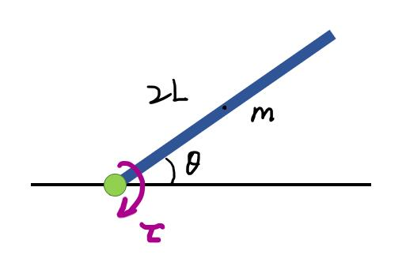
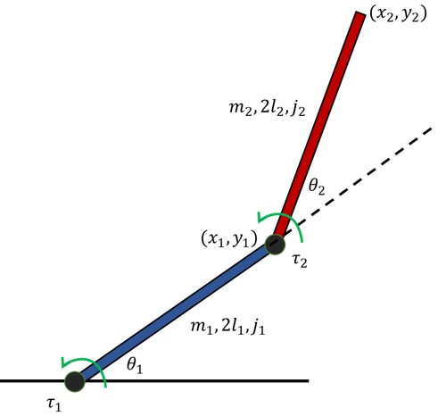

[//]: # (comment like this)

<!---

--->

<!---
Add LaTeX by using https://www.codecogs.com/latex/eqneditor.php
--->

# Optimal-Control-on-multi-arm-linkage

- [Optimal-Control-on-multi-arm-linkage](#optimal-control-on-multi-arm-linkage)
    - [Overview](#overview)
    - [Arm linkage system modelling](#arm-linkage-system-modelling)
        - [Single arm system](#single-arm-system)
        - [Two-arm system](#two-arm-system)
        - [General method of for multi-arm system](#general-method-of-for-multi-arm-system)
    - [Optimal Control Design](#optimal-control-design)

## Overview

The purpose of this project is to test how optimal control methods can work in nonlinear systems. Suppose we have a multi-arm system, and we want to control the 

## Arm linkage system modelling

### Single arm system

To start with, we first start with a single arm system. The physics for this is simple, but this is a simple way to test if the controller is working.

Assume each arm has a mass of **m**, length of **2L**, and an inertia of **j** with respect to its center of gravity. A torch input **&tau;** is used to control the arm angle **&theta;**, as shown in the figure below.

Since only torque, gravity of arm are considered in the motion equation, the equation of motion for this single-input-single-output(SISO) system is quite simple:

### Two-arm system

Things becomes more difficult when more arms are introduced. The equation of motion is complex since centrifugal and Coriolis force are playing an important role. We will introduce a general way to generate the eom in later section. But now, we are using Lagrangian mechanics to solve this system.

As seen in the figure, we define the end effector of first and second arm as (x1, y1) and (x2,y2). Therefore, we can get:

which can be used to calculate corresponding &theta; based on x using inverse kinematics.

For the equation of motion, we have kinetic energy of system:

where

On the other hand, we have potential energy of system

We get the Lagrangian L=KE-PE as:

Using Lagrangian mechanics, we have:

Simplify this equation, we can get the form of this equation of motion to be:

<a href="https://www.codecogs.com/eqnedit.php?latex=\underbar&space;u=&space;\begin{bmatrix}&space;\tau_1\\&space;\tau_2&space;\end{bmatrix}&space;=&space;\begin{bmatrix}&space;H_{11}&space;&&space;H_{12}&space;\\&space;H_{21}&space;&&space;H_{22}&space;\end{bmatrix}&space;\begin{bmatrix}&space;\ddot{\theta_1}\\&space;\ddot{\theta_2}&space;\end{bmatrix}&space;&plus;&space;\begin{bmatrix}&space;h\dot{\theta_2}^2&plus;2h\dot{\theta_1}\dot{\theta_2}\\&space;h\dot{\theta_1}\dot{\theta_2}&space;\end{bmatrix}&space;&plus;&space;\begin{bmatrix}&space;G_1\\&space;G_2&space;\end{bmatrix}" target="_blank"></a>

where

This gives us the dynamic model(also known as dynamic constraint in controller) of the two arm linkage system. We can see the increase of complexity with number of arms in the equation.

### General method of for multi-arm system

We will use projected Newton Euler Equation to solve for eom of multi-arm system.

(to be continued...)

## Optimal Control Design
